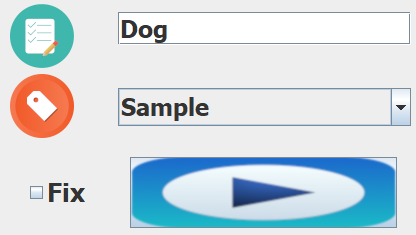
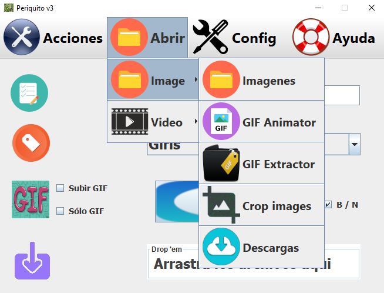
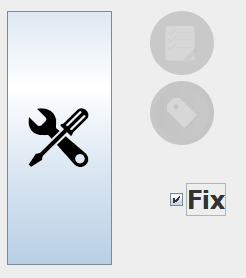
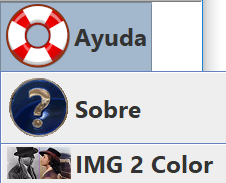

# Periquito v3.0

---

# 1. ¿Qué es Periquito v3.0?

## 1.1 Este programa está pensado principalmente para

- Redimensionamiento masivo de imagenes y creación de miniaturas para subir a un CMS de gestión de imágenes 

---

## 1.2 Acciones automáticas

- Crea carpetas para su funcionamiento

- Cada imagen se redimensiona y se renombra con la fecha y hora actual y se convierte a jgp 

- Mueve las imagenes al servidor (por red, es decir, mediante una carpeta compartida)

---

## 1.3 Requisitos

- Google Chrome

[Chrome](https://www.google.com/intl/es_ALL/chrome/)

- Servidor web con base de datos MySQL (WAMP O LAMP)

[Windows](http://prdownloads.sourceforge.net/appserv/appserv-win32-8.6.0.exe?download)

### Linux
~~~bash
sudo apt update
sudo apt install apache2

# Abra el archivo de configuración principal con su editor de texto:

sudo nano /etc/apache2/apache2.conf

# Escribimos ServerName dominio_del_servidor_o_IP 

# Guardamos y cerramos el archivo

sudo systemctl restart apache2

sudo apt install mysql-server php mysql

sudo apt install php libapache2-mod-php php-mcrypt php-mysql php-cli

sudo systemctl restart apache2
~~~

- Java

[Java](https://www.java.com/es/download/)

----

## 1.4 Instalación CMS

- Accede a http://localhost/4images/install.php

## 1.5 Configuración la aplicación PHP para subir imágenes masivas al CMS

- Descarga el archivo "chromedriver.exe" de [Chrome Driver](http://chromedriver.chromium.org/downloads) o [Chrome Driver](https://sites.google.com/a/chromium.org/chromedriver/downloads)

- Pega el archivo en la misma carpeta que "copiar.bat"

- Debes tener una carpeta "Periquito" en el servidor

- Dentro de esta, debes tener una carpeta llamada "imagenes" con esta estructura

- ->imagenes
- --->Thumb
- --->gif
- ----->Thumb

- Debes tener una carpeta llamada "img" dentro de la carpeta "Hacer_gif"

- Debes tener una carpeta llamada "Output" dentro de la carpeta "Hacer_gif"

- Copia o mueve tus imagenes a la carpeta imagenes

- Los archivos .gif también van en la carpeta imagenes

----

# 2. Manual del programa Java

Ejecutar "Empezar.java" o el ".jar" de la aplicación

- Escribir el nombre común de las imagenes

- Seleccionar la categoria y pulsar el botón "Play"

- Listo!!

----

## 2.1 Utilidades de conversión (Crear GIF, GIF a frames,Video a GIF,Video a frames)

- Tenemos que pegar el archivo requerido en cada carpeta del programa

- Hacer clic en la accion que queramos

----

## 2.2 Casilla Fix

- Esta opción cierra el navegador y copia las imágenes por red al CMS

----

# 3. Ayuda

- En la seccion ayuda se nos muestran los pasos para las configuraciones del programa

- Enlace a una página web para convertir fotos en blanco y negro a color

