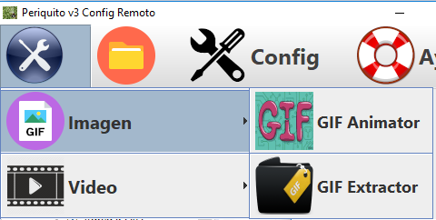
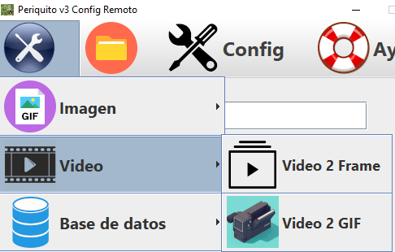
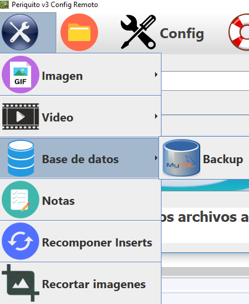

# Periquito - Cliente del CMS 4images-UPDATED

---

# 1. ¿Qué es Periquito?

- Este programa principalmente está pensado para subir imágenes masivas a un CMS de gestión de imágenes

---

## 1.1 Acciones automáticas

- Crea carpetas para su funcionamiento

- Cada imagen se redimensiona y se renombra con la fecha y hora actual y se convierte a JPG 

- Mueve las imágenes procesadas al servidor

---

## 1.2 Requisitos

### Sistemas Operativos soportados

-Windows Vista o posterior

-Linux

### Dependencias

- Windows

[Google Chrome](https://www.google.com/intl/es_ALL/chrome/)

[Chrome Driver](http://chromedriver.chromium.org/downloads)

[Java](https://www.java.com/es/download/)

[Wamp](http://prdownloads.sourceforge.net/appserv/appserv-win32-8.6.0.exe?download)

[FFMPEG](http://ffmpeg.org/download.html)

- Copiar los archivos ffmpeg.exe y ffmpegprobe.exe en C:\Windows\System32 y en C:\Windows\SysWow64 (para equipos de 64 bits)

---

### Linux

[Linux Dependencies](https://github.com/ComandPromt/Periquito/tree/master/Scripts_Linux_Dependencies)

----

## 1.3 Instalación del CMS

[CMS](https://github.com/ComandPromt/4images-UPDATED)

- Accede a http://localhost/4images/install.php (cambia "localhost" por la IP o dominio del servidor)

----

## 1.4 Configuración de las Utilidades

- [Conversores](https://github.com/ComandPromt/Periquito/tree/master/Periquito)

- Descomprime y pega cada utilidad en la carpeta raíz del servidor web

----

# 2. Manual del programa Java

- Nota: antes de nada debes tener un archivo llamado "chromedriver.exe" en la carpeta de la aplicación. Se puede descargar desde [Chrome Driver](http://chromedriver.chromium.org/downloads) o [Chrome Driver](https://sites.google.com/a/chromium.org/chromedriver/downloads)

## Iniciar la aplicación

Ejecutar "Empezar.java" , el ".JAR" o ".EXE" de la aplicación

## Uso de la utilidad principal

- Escribir el nombre común de las imágenes (En este caso subiremos varias imágenes de perros)

- Seleccionar la categoría correspondiente y pulsar el botón "Play"

- Listo!!

### Nota: se debe tener en cuenta que se mostrará un mensaje de las veces que tienes que pulsar el botón de play en el caso de que se quieran subir más de 40 imágenes al CMS

----

## 2.1 Utilidades de conversión (Crear GIF, GIF a frames, Video a GIF, Video a frames)

- Tenemos que pegar el archivo requerido en cada carpeta del programa

- Hacer clic en la acción que queramos

- Frames a GIF

- GIF a frames

- Video a Frames

- Video a Gif

----

# 3. Ayuda

- En la sección ayuda se nos muestran los pasos para las configuraciones del programa

- Enlace a una página web para convertir fotos en blanco y negro a color

----

# 4. Utilidades

---

- Copia de seguridad de la base de datos

- Anotaciones de las imágenes

- Recomponer inserts: esta opción sirve para insertar los registros perdidos de las imágenes en la base de datos en caso de pérdida de datos de la tabla de las imágenes y conservemos las imágenes en el servidor

- Recortar imágenes: utilidad para recortar la misma zona en todas las imágenes

----

## GIF 2 Frames

[GIF 2 Frames](https://gifframes.herokuapp.com/)

[Source](https://github.com/ComandPromt/GifFrames-API)

---
## Frames 2 GIF

[Source](https://github.com/ComandPromt/Frames-to-GIF)

---
## Video 2 Frames

[Source](https://github.com/ComandPromt/Video-to-frames-php)

---

# Image API

*Nota: se usa esta API para asegurar que las imágenes se suben en orden alfabético, es decir, en el mismo orden que tenían antes de ser renombradas. Esta API se usará en el programa Java para que el usuario sólo tenga en el servidor web las utilidades del programa

[API](https://dashboard.heroku.com/apps/apiperiquito)

[Source](https://github.com/ComandPromt/Images-Periquito-API)
